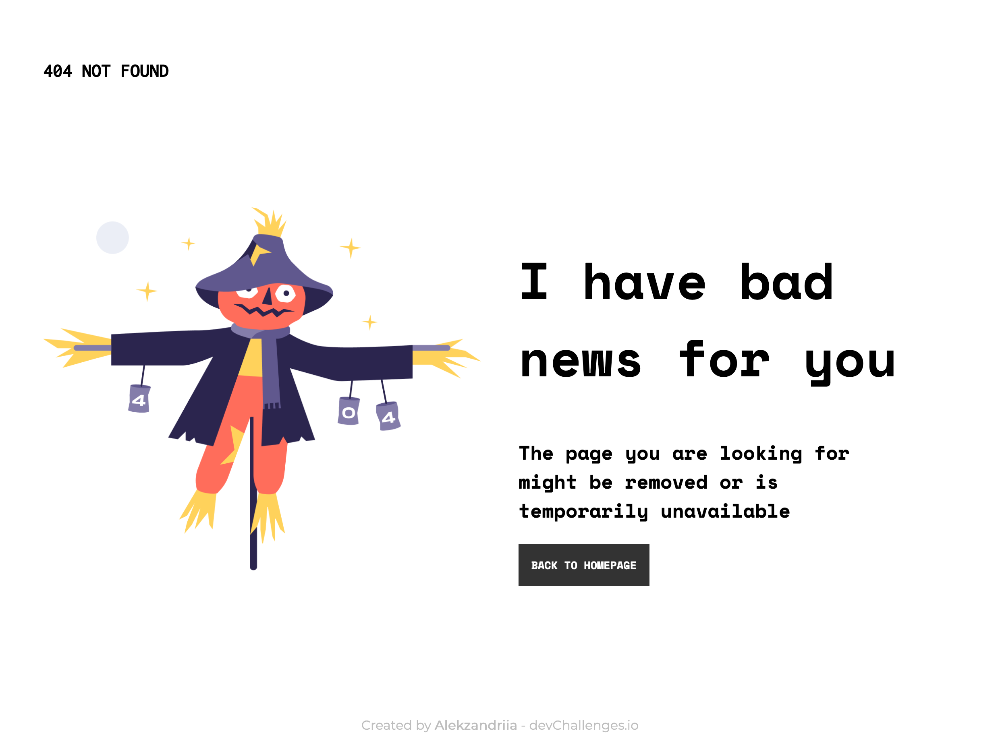
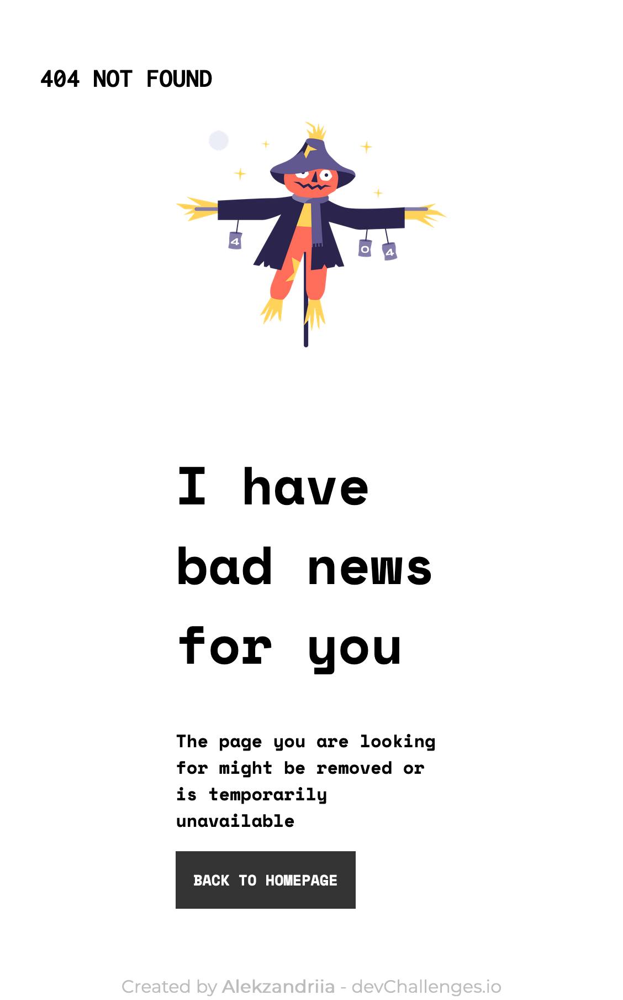

<!-- Please update value in the {}  -->

<h1 align="center">404 Not Found</h1>

   Solution for a challenge from  <a href="http://devchallenges.io" target="_blank">Devchallenges.io</a>.

  <h3>
    <a href="https://alexoreilly.me/devchallenges.io/404-not-found-master">
      Demo
    </a>
     | 
    <a href="https://github.com/alekzandriia/devchallenges.io/tree/main/404-not-found-master">
      Solution
    </a>
     | 
    <a href="https://devchallenges.io/challenges/wBunSb7FPrIepJZAg0sY">
      Challenge
    </a>
  </h3>

<!-- TABLE OF CONTENTS -->

## Table of Contents

- [Overview](#overview)
  - [Built With](#built-with)
- [Features](#features)
- [Contact](#contact)
- [Acknowledgements](#acknowledgements)

<!-- OVERVIEW -->

## Overview

`A cute little way to let the user know that the server can't find the page they requested.` 👻

This is a template for a 404 Not Found page. It contains the basic structure of an HTML document, with a head section and a body section. The head section contains metadata, such as the document type, character encoding, and viewport settings. It also includes links to external resources, such as fonts, icons, and stylesheets. The body section contains the main content of the page, including a header, a main section, and a footer. It is designed to be responsive and adapts to both mobile and desktop screen sizes by using CSS Flexbox and media queries to dynamically adjust sizes.

_TL;DR_
This HTML code is a template for a 404 Not Found page. It includes metadata, links to external resources, and the main content of the page.

### Built With

<!-- This section should list any major frameworks that you built your project using. Here are a few examples.-->

Simple stack for a simple project.

- [HTML](https://html.spec.whatwg.org/)
- [CSS](https://www.w3.org/TR/css-2022/)

## Features

<!-- List the features of your application or follow the template. Don't share the figma file here :) -->

This site was created as a submission to a [DevChallenges](https://devchallenges.io/challenges) challenge. The [challenge](https://devchallenges.io/challenges/wBunSb7FPrIepJZAg0sY) was to build an application to complete the given user stories. user story: I can see a page following the given design.

## Contact

- Website [alekzandriia.com](https://www.alekzandriia.com)
- GitHub [@alekzandriia](https://github.com/alekzandriia)
- Twitter [@alekzandriia](https://twitter.com/alekzandriia)
