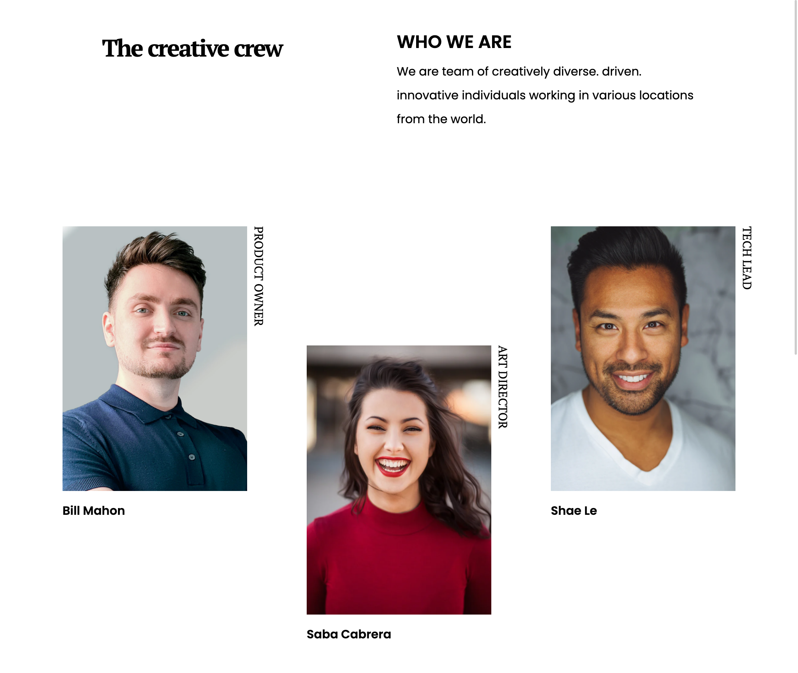
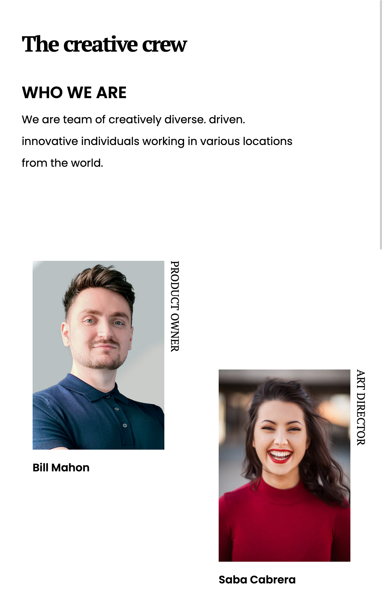

<!-- Please update value in the {}  -->

<h1 align="center">My Team</h1>

   Solution for a challenge from  <a href="http://devchallenges.io" target="_blank">Devchallenges.io</a>.

  <h3>
    <a href="https://alexoreilly.me/devchallenges.io/my-team-page-master">
      Demo
    </a>
     | 
    <a href="https://github.com/alekzandriia/devchallenges.io/tree/main/my-team-page-master">
      Solution
    </a>
     | 
    <a href="https://devchallenges.io/challenges/hhmesazsqgKXrTkYkt0U">
      Challenge
    </a>
  </h3>

<!-- TABLE OF CONTENTS -->

## Table of Contents

- [Overview](#overview)
  - [Built With](#built-with)
- [Features](#features)
- [Contact](#contact)

<!-- OVERVIEW -->

## Overview

`Responsive team page with a header, main section, and footer. The main section contains a list of team members with their names, titles, and photos.`

### Built With

<!-- This section should list any major frameworks that you built your project using. Here are a few examples.-->

- [HTML](https://html.spec.whatwg.org/)
- [CSS](https://www.w3.org/TR/css-2022/)

## Features

<!-- List the features of your application or follow the template. Don't share the figma file here :) -->

This web page was created as a submission to a [DevChallenges](https://devchallenges.io/challenges) challenge. The [challenge](https://devchallenges.io/challenges/hhmesazsqgKXrTkYkt0U) was to build an application to complete the given user stories.

User story: I can see a page following the given design

## Contact

- Website [alekzandriia.com](https://www.alekzandriia.com)
- GitHub [@alekzandriia](https://github.com/alekzandriia)
- Twitter [@alekzandriia](https://twitter.com/alekzandriia)
